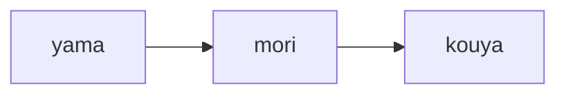
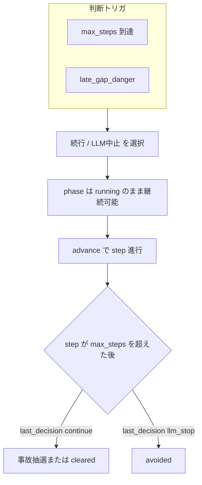

# ロールプレイング・シミュレーション構成（デモ UI）

このドキュメントは、`apps/demo_web` のデモにおける **物語的地名・背景画像・エンディング** と、バックエンドの **数値シミュレーション** の対応関係を整理する。

## 1. 画面側の「場所」一覧（`rp_zone`）

API のスナップショットに含まれる `rp_zone`（`risk_simulator.RiskSimulator.rp_zone()`）は、フロントで `static/image/*.jpg` を切り替えるキーになる。

| `rp_zone`   | 画像ファイル       | 意味（ナラティブ） |
|------------|-------------------|---------------------|
| `yama`     | `yama.jpg`        | スタート（山・登山口付近） |
| `mori`     | `mori.jpg`        | 森に入る区間 |
| `kouya`    | `kouya.jpg`       | 高地・荒野。分岐の手前で「休憩／踏み込み」の緊張が高まる区間 |
| `home`     | `home.jpg`        | **帰還エンド**（中止・回避） |
| `mori_yoru`| `mori_yoru.jpg`   | **暗転エンド**（続行が危険側に倒れた結果） |
| `umi`      | `umi.jpg`         | **ゴールエンド**（条件良好のまま踏み切った結果） |

進行中は **ステップ進捗率** `step / max_steps` のみで `yama → mori → kouya` に遷移する（閾値はシミュレータ内の定数）。`step` が計画の `max_steps` を超えたあともプレイが続く場合、比率は 1 を超えうる（同一式で `kouya` 側に寄る）。

## 2. プレイ中の地名遷移（線形ルート）

- `step / max_steps < 0.28` → `yama`
- `0.28 ≤ … < 0.55` → `mori`
- それ以外（かつ未終了）→ `kouya`

閾値は `risk_simulator.py` の `rp_zone()` で一元管理する。

## 3. 終了時の分岐（意思決定とアウトカム）

**拡張要件の全体像（vNext）は [rp_ui_and_simulation_vnext.md](rp_ui_and_simulation_vnext.md) を参照。**

以下は現行 `RiskSimulator` の挙動に合わせた要約である。

### 3.1 判断が必要になるタイミング（トリガ）

API スナップショットの `judgment_trigger_reason` / `decision_mode` で把握できる。

| 理由コード（`reason_code`） | 意味 |
|-----------------------------|------|
| `max_steps` | 計画ステップ `max_steps` に到達したとき |
| `late_gap_danger` | 計画の約 **85%** 以降で `Gap ≥ 0.2`（`gap_danger`）となったとき、**一度だけ**判断を促す。メトリクスが改善すると提示は下りる |

優先順位は **`max_steps` > `late_gap_danger`**（計画到達時は途中トリガより優先）。

### 3.2 既定モード（`legacy_decision == false`）

判断を選んでも **即 `phase = ended` にならない**。その後 **`advance()`** でステップが進み、計画ステップを超えた区間で帰結が決まる。

- **続行（`continue`）** … `step > max_steps` のあとの各 `advance` 後に、メトリクスに基づく**事故確率の抽選**があり、当たれば `outcome = accident`。一定ステップ経過で `cleared` もありうる（実装は `risk_simulator.py` の `_resolve_post_decision_outcome`）。
- **中止（`llm_stop`）** … 一定ステップ経過で `outcome = avoided`。
- **進行上限** … シミュレータ全体のステップ上限は **`MAX_STEPS`（70）**。`can_advance` が `false` になるとこれ以上進めない。

終了後の `rp_zone` は **`outcome`** によって決まる（下表）。

| `outcome` | `rp_zone` | ナラティブの目安 |
|-----------|-----------|------------------|
| `avoided` | `home` | 帰還・回避 |
| `accident` | `mori_yoru` | 暗転 |
| `cleared` | `umi` | ゴール |

### 3.3 レガシーモード（`legacy_decision == true`）

従来どおり、**計画ステップ到達時の判断だけ**が有効で、選択後 **即 `ended`**。

- **`continue`** … `gap_danger` または `R_obj ≥ 0.42` を危険側とみなし、`accident` / `cleared` を**決定論的**に分岐（チューニングは `decide_continue()` 内）。
- **`llm_stop`** … `avoided` で即終了。

デモ UI のリセット API では既定では切り替えない。コードから `new_simulator(..., legacy_decision=True)` が必要。

## 4. パーティ表示（キャラクターと動き）

- **見た目**: `static/css/character{1,2,3}.css` の `.dot-1` / `.dot-2` / `.dot-3` を重ねる。
- **隊形**: キャラ 1 を上、2 を右、3 を左に置き **三角形**（上・右下・左下）。
- **サイズ**: キャラ 1・2 はベース比 **1.7 倍**、3 はベース（`demo.css` の `trail-char-scale--party-lg` / `--party-sm`）。
- **動き**: シーン中央付きを基準に、進捗に応じた角度で **ゆっくり円運動**（同一の円上を３人が三角形を保ちながら移動）。歩行中は軽いボブアニメーション。

## 5. 数値シミュ本体との関係

- **ソース・オブ・トゥルース**は引き続き Python の `RiskSimulator`（`R_obj` / `R_subj` / `Gap` 等）。
- **地名・背景・隊形**は主に体験のメタファであり、設計書 v2 の数式そのものを変えるものではない。
- Ollama 引率（`DEMO_GUIDE_AGENT`）が有効な場合も、`trek` / `rest` は **1 ステップの種類**であり、`rp_zone` の線形区間とは独立に効く（休憩は疲労などのリカバリとして数値に反映）。

## 6. 関連ファイル

| 種別 | パス |
|------|------|
| 地名・判断ロジック | `apps/demo_web/risk_simulator.py`（`rp_zone`, `decide_*`, `_resolve_post_decision_outcome`） |
| API | `apps/demo_web/app.py`（`_enrich` 経由で `snapshot` に `rp_zone` が載る） |
| 背景・隊形 | `apps/demo_web/static/js/demo/trail.js`, `static/css/demo.css` |
| デモ説明（静的） | `apps/demo_web/static/guide/`（上記 HTML と `legacy.html`）、`static/css/demo-guide.css` |
| 画像 | `apps/demo_web/static/image/*.jpg` |

---

**改版メモ**: 閾値（`yama`/`mori` の境界、判断トリガの比率・事故確率、`R_obj` のレガシー続行判定）はバランス調整で変わりうる。変更時は本書のセクション 2・3 とコードのコメントを同期させること。

| 日付 | 内容 |
|------|------|
| 2026-05-04 | 多段判断・トリガ・既定／レガシー分岐を反映 |
