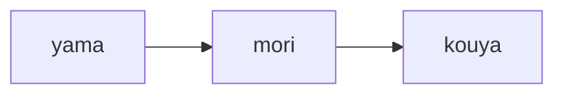
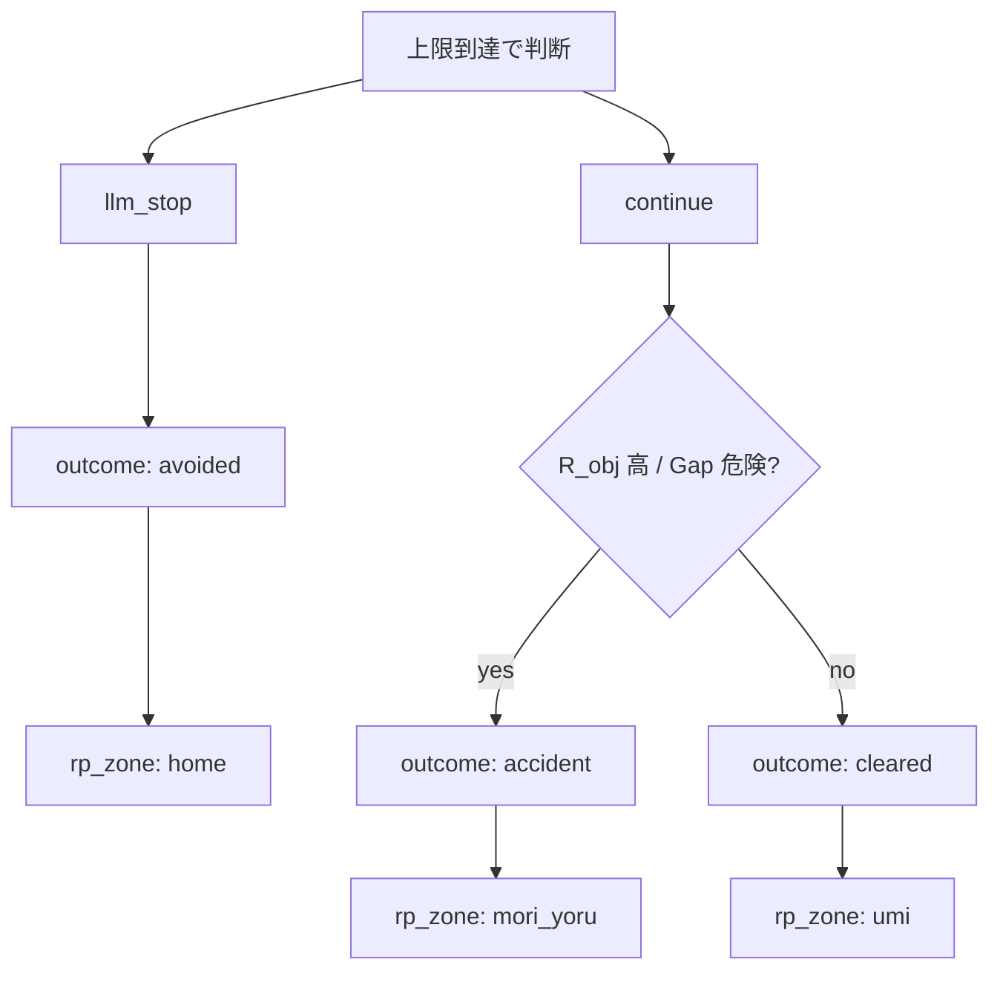

# ロールプレイング・シミュレーション構成（デモ UI）

このドキュメントは、`apps/demo_web` のデモにおける **物語的地名・背景画像・エンディング** と、バックエンドの **数値シミュレーション** の対応関係を整理する。

## 1. 画面側の「場所」一覧（`rp_zone`）

API のスナップショットに含まれる `rp_zone`（`risk_simulator.RiskSimulator.rp_zone()`）は、フロントで `static/image/*.jpg` を切り替えるキーになる。

| `rp_zone`   | 画像ファイル       | 意味（ナラティブ） |
|------------|-------------------|---------------------|
| `yama`     | `yama.jpg`        | スタート（山・登山口付近） |
| `mori`     | `mori.jpg`        | 森に入る区間 |
| `kouya`    | `kouya.jpg`       | 高地・荒野。分岐の手前で「休憩／踏み込み」の緊張が高まる区間 |
| `home`     | `home.jpg`        | **帰還エンド**（中止・回避） |
| `mori_yoru`| `mori_yoru.jpg`   | **暗転エンド**（続行が危険側に倒れた結果） |
| `umi`      | `umi.jpg`         | **ゴールエンド**（条件良好のまま踏み切った結果） |

進行中は **ステップ進捗率** `step / max_steps` のみで `yama → mori → kouya` に遷移する（閾値はシミュレータ内の定数）。

## 2. プレイ中の地名遷移（線形ルート）

- `step / max_steps < 0.28` → `yama`
- `0.28 ≤ … < 0.55` → `mori`
- それ以外（かつ未終了）→ `kouya`

閾値は `risk_simulator.py` の `rp_zone()` で一元管理する。

## 3. 終了時の分岐（意思決定とアウトカム）

**拡張要件（vNext：多段判断・確率的帰結・チャット LLM 化・フラグ UI）は [rp_ui_and_simulation_vnext.md](rp_ui_and_simulation_vnext.md) を参照。**

上限ステップに達すると「続行」か「LLM 介入 → 中止」が選べる。終了後の `rp_zone` は **`outcome`** によって決まる。

- **`avoided`（中止）** → `home`（「荒野で一度立ち止まり帰る」＝安全側の語りに合わせた帰還画面）
- **`accident`（続行・危険側）** → `mori_yoru`（「そのまま突き進み引き返せない」イメージ）
- **`cleared`（続行・条件良好）** → `umi`（ゴール）

`continue` の二分は `decide_continue()` 内で、概ね **`gap_danger` または `R_obj ≥ 0.42`** を危険側とみなす（チューニング可能）。

## 4. パーティ表示（キャラクターと動き）

- **見た目**: `static/css/character{1,2,3}.css` の `.dot-1` / `.dot-2` / `.dot-3` を重ねる。
- **隊形**: キャラ 1 を上、2 を右、3 を左に置き **三角形**（上・右下・左下）。
- **サイズ**: キャラ 1・2 はベース比 **1.7 倍**、3 はベース（`demo.css` の `trail-char-scale--party-lg` / `--party-sm`）。
- **動き**: シーン中央付きを基準に、進捗に応じた角度で **ゆっくり円運動**（同一の円上を３人が三角形を保ちながら移動）。歩行中は軽いボブアニメーション。

## 5. 数値シミュ本体との関係

- **ソース・オブ・トゥルース**は引き続き Python の `RiskSimulator`（`R_obj` / `R_subj` / `Gap` 等）。
- **地名・背景・隊形**は主に体験のメタファであり、設計書 v2 の数式そのものを変えるものではない。
- Ollama 引率（`DEMO_GUIDE_AGENT`）が有効な場合も、`trek` / `rest` は **1 ステップの種類**であり、`rp_zone` の線形区間とは独立に効く（休憩は疲労などのリカバリとして数値に反映）。

## 6. 関連ファイル

| 種別 | パス |
|------|------|
| 地名ロジック | `apps/demo_web/risk_simulator.py`（`rp_zone`, `decide_continue`） |
| API | `apps/demo_web/app.py`（`_enrich` 経由で `snapshot` に `rp_zone` が載る） |
| 背景・隊形 | `apps/demo_web/static/js/demo.js`, `static/css/demo.css` |
| 画像 | `apps/demo_web/static/image/*.jpg` |

---

**改版メモ**: 閾値（`yama`/`mori` の境界、`R_obj` の続行判定）はバランス調整で変わりうる。変更時は本書のセクション 2・3 とコードのコメントを同期させること。
